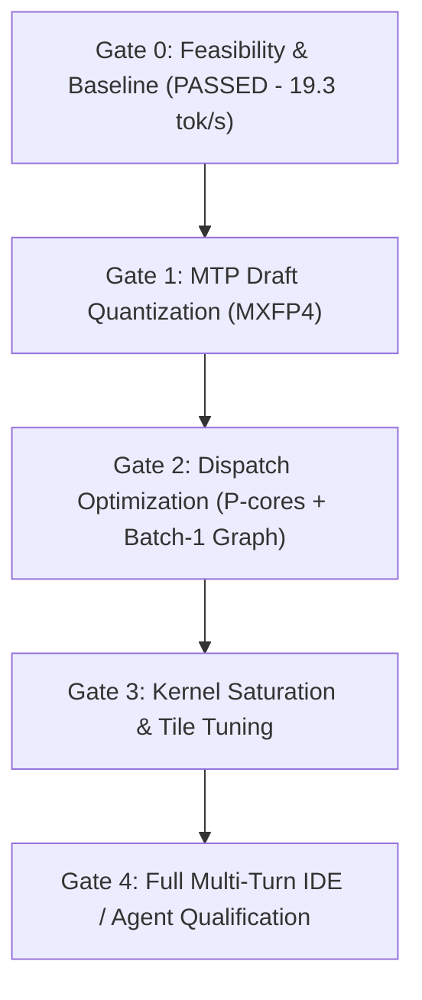

# Plan: vLLM XPU Optimization for Intel Core Ultra 7 258V & Tiel-Coder-35B-A3B

> **Status:** Active Engineering Optimization Roadmap  
> **Target Hardware:** Intel Core Ultra 7 258V (Lunar Lake, Arc 140V Xe2 iGPU, 64 Vector Engines / 8 Xe-cores, 32 GB unified LPDDR5X-8533)  
> **Target Model:** `symrex/Tiel-Coder-35B-A3B-Genesis-Hermes-MXFP4` / `pahajokiconsulting/Qwen3.6-35B-A3B-MXFP4` (Sparse MoE Hybrid: 40 layers = 30 GDN linear attention + 10 full attention, 256 routed experts / 8 active, 35.95B total / ~3B active params)  
> **Environment:** CachyOS Linux (kernel 7.2.x), Intel Compute Runtime 26.35, oneAPI Level-Zero 1.17+, PyTorch 2.13.0+xpu, vLLM 0.30.0+xpu, vllm-xpu-kernels 0.1.14.1

---

## 0. Executive Summary & Baseline Reality

Initial feasibility (Phases 0–9) is **fully established**: the model runs stably on vLLM XPU with zero OOM, correct output, and full tool-calling support. However, comparative benchmarks against custom bare-metal Level-Zero ([`AInfer`](file:///home/yanchun/Projects/AInfer/README.md)) and Vulkan ([`llama.cpp`](file:///home/yanchun/Projects/vllm.xpu/fallback-comparison.md)) reveal clear optimization potential:

```
========================================================================================
Decode Throughput Comparison (Tokens/Sec @ P=1024, Batch=1, Intel Arc 140V 258V)
========================================================================================
vLLM XPU Baseline (Eager, MXFP4):         [================] 19.15 tok/s (Current floor)
vLLM XPU + MTP (1 Spec Token, BF16 Draft): [======================] 25.50–26.83 tok/s (+39%)
llama.cpp Vulkan (Q4_K_M):                 [=========================] 28.69 tok/s (Roofline bound)
AInfer Level-Zero (INT4-g128):             [==============================| 35.06–35.91 tok/s (95% Roofline)
AInfer Dual-Token MTP (INT4 Draft):        [===========================================] 45.62–51.72 tok/s
========================================================================================
```

### The Physical Roofline on 258V
- **Memory Bandwidth**: Theoretical peak is 136.53 GB/s; measured isolated stream read bandwidth is **103.03 GB/s** (LPDDR5X-8533 128-bit).
- **Weight Streaming**: In INT4/MXFP4, active weights streamed per decode step are **~1.17–1.35 GB**. At 103 GB/s, pure memory transfer takes only **~11.5–13.5 ms/token**.
- **Theoretical Decode Ceiling**: **~35–38 tok/s** for standard greedy decode.
- **The Gap**: vLLM eager decode spends ~52 ms/token (19.2 tok/s). ~13 ms is memory bandwidth; the remaining **~35–39 ms is framework dispatch overhead, driver queue transitions, and non-expert layer stalls** across the 40 layers on the 8-core CPU.

---

## 1. Primary Objectives & Target Milestones

| Milestone | Target Decode | Target Memory | Key Mechanism | Measured (2026-09-27) |
|---|---|---|---|---|
| **M1: Optimized Speculative MTP** | **> 32 tok/s** | Weight RSS < 20.6 GiB | MXFP4 quantized draft model + speculative token tuning ($K=1, 2$) | **27.69 tok/s** (K=2, MXFP4 draft); weights **19.71 GiB** (−1.1). Target missed: single-layer draft reuse caps acceptance (vLLM warn). |
| **M2: Low-Overhead Dispatch** | **> 23 tok/s** (eager) | MemAvailable > 3.0 GiB | Single-batch XPU graph capture (`batch=1`) + CPU P-core pinning | Graph[1] **19.93** (+4% over 19.15) but MemAvailable **0.7 GiB** — functional, rejected on this host. Pinning implemented (env-gated). |
| **M3: EU Saturation & Kernel Polish** | **> 27 tok/s** (eager) | Unchanged | Multi-workgroup attention splitting for 64 Vector Engines + 8 Xe-core tile tuning | Split-K **already present** (`build_decode_split_plan`); attention delta only 0.94 ms @7K — MoE-bound, no work filed. |
| **M4: Production Agent Readiness** | Flat across 7K+ ctx | Zero HTTP timeouts | Keep-alive heartbeats, instant disconnect abort, prefix caching audit | Deferred (14.x untouched except thinking-budget caveat). |

---

## 2. Optimization Workstreams

### Workstream 1: Model & Speculative Decoding (MTP) Optimization

- [ ] **1.1 Quantize MTP Draft Block to MXFP4**
  - **Problem**: The MTP draft block (`mtp.0`) is currently instantiated in **BF16 (~1.69 GiB)**, raising total resident weights to 21.57 GiB and leaving only ~2.1 GiB host memory headroom. Draft verification also wastes DRAM bandwidth reading BF16 weights.
  - **Action**: Extend [`scripts/quantize_tiel_mxfp4.py`](file:///home/yanchun/Projects/vllm.xpu/scripts/quantize_tiel_mxfp4.py) to quantize the draft expert weights to MXFP4 (`mxfp4-pack-quantized`), matching the main trunk schema.
  - **Success Criteria**: Resident weights drop by ~1.1 GiB (from 21.57 GiB to ~20.5 GiB); host `MemAvailable` increases to >3.2 GiB; draft execution latency decreases.

- [ ] **1.2 Speculative Depth & Acceptance Sweep ($K=1$ vs $K=2$)**
  - **Problem**: Current configuration tests `--speculative-config '{"method":"mtp","num_speculative_tokens":1}'` yielding 25.5 tok/s. AInfer demonstrates that dual-token verification ($K=2$) achieves 45.6–51.7 tok/s on coding and reasoning prompts.
  - **Action**: Benchmark `num_speculative_tokens=2` across coding tasks (e.g. Python functions, FIM autocomplete). Measure token acceptance rate ($\alpha$) and net throughput.
  - **Success Criteria**: Decode throughput exceeds **30+ tok/s** on high-acceptance code completion prompts.

- [ ] **1.3 Stop Sequence & EOS Cleanliness**
  - **Problem**: Stale token IDs (`151643`, `151645`) from Qwen2.5 (152K vocab) can cause premature stops or missed termination. True EOS tokens for this model (248K vocab) are `248044` (`<|endoftext|>`) and `248046` (`<|im_end|>`).
  - **Action**: Verify `generation_config.json` and vLLM server launch parameters explicitly map EOS tokens `[248044, 248046]`.

---

### Workstream 2: CPU & Driver Dispatch Elimination (Overcoming the 8-Core Bottleneck)

- [ ] **2.1 Single-Batch Specialized XPU Graph (`capture_sizes=[1]`)**
  - **Problem**: In Phase 9, `VLLM_XPU_ENABLE_XPU_GRAPH=1` bumped decode to 19.84 tok/s (+3%) but was rejected because capturing graph sizes `[1, 2, 4]` consumed too much device memory, dropping host `MemAvailable` to 1.48 GiB.
  - **Action**: Configure the XPU graph runner to capture **strictly batch size 1** (the single-user interactive case), eliminating multi-batch graph memory duplication while removing Python-to-Level-Zero dispatch boundaries for every layer.
  - **Success Criteria**: Host memory overhead < 250 MiB; decode speed increases by 5–10% without memory pressure.

- [ ] **2.2 CPU Core Pinning to Lion Cove P-Cores (`taskset -c 0-3`)**
  - **Problem**: Lunar Lake 258V features 4 Lion Cove Performance cores (0–3) and 4 Skymont Low-Power Efficient cores (4–7). If vLLM scheduling or Level-Zero submission threads migrate to LP-E cores, token scheduling jitter and launch latency surge.
  - **Action**: Enforce process affinity to P-cores in [`scripts/launch_vllm.sh`](file:///home/yanchun/Projects/vllm.xpu/scripts/launch_vllm.sh):
    ```bash
    exec taskset -c 0-3 python -m vllm.entrypoints.openai.api_server "${ARGS[@]}"
    ```
  - **Success Criteria**: Lower inter-token variance (p95/p99 jitter reduced); measurable TTFT reduction on cold prefill.

- [ ] **2.3 SoC Power Profile & iGPU Clock Locking**
  - **Problem**: Lunar Lake package TDP is nominally 17W (burst 37W). Under sustained inference, thermal power balancing throttles the Arc 140V clock down to 1.2–1.4 GHz.
  - **Action**: Evaluate setting energy performance bias and power limits via Linux powercap/sysfs (`/sys/class/powercap/intel-rapl`) or `xpu-smi` to sustain GPU clock at **~1.95 GHz**.

---

### Workstream 3: Kernel Micro-Architecture Specialization (Xe2 Arc 140V)

- [ ] **3.1 Full Attention Vector Engine (EU) Saturation Audit**
  - **Problem**: AInfer's hardware audit proved that Arc 140V has **64 Vector Engines (EUs)**, but Qwen3.6 has only **16 query heads** in full attention layers. Standard 1-workgroup-per-head dispatch leaves 48 of the 64 EUs idle, doubling attention latency at long contexts.
  - **Action**: Inspect vLLM's `vllm-xpu-kernels` decode attention implementation (`libattn_kernels_xe_2.so`). Check whether workgroups are parallelized across sequence length / KV tiles (similar to AInfer's Split-T attention `AINFER_ATTN_SPLIT=4`).
  - **Success Criteria**: Maintain flat decode rate (>18 tok/s) out to 8K+ context without EU under-utilization stalls.

- [ ] **3.2 MoE Grouped GEMM Tile Calibration**
  - **Problem**: `cutlass_grouped_gemm_interface` in `vllm-xpu-kernels` is built with generic Xe2/Xe3 parameters suitable for 16–32 Xe-core parts (Arc Pro B60). 
  - **Action**: Profile threadblock occupancy and register pressure on Arc 140V (8 Xe-cores). Evaluate if smaller tile sizes or SIMD16 subgroup butterflies reduce pipeline stalls.

- [ ] **3.3 Flash Attention vs Prefill Chunking Sizing**
  - **Problem**: vLLM currently leads in prefill throughput (~950–2028 tok/s), but `max_num_batched_tokens` tuning directly affects intermediate workspace allocations.
  - **Action**: Sweep `max_num_batched_tokens` [1024, 2048, 4096] to determine the optimal trade-off between TTFT, prefill throughput, and workspace RAM footprint.

---

### Workstream 4: Serving, IDE Copilot & Agent Usability

- [ ] **4.1 Instant Client Disconnect Abort**
  - **Problem**: In IDE tab-autocomplete (Continue.dev / Cursor / OpenCode), rapid typing creates cancelled requests. If vLLM continues generating tokens after client disconnect, GPU execution blocks the next keystroke.
  - **Action**: Verify that vLLM's HTTP server immediately cancels generation tasks upon client socket closure (`asyncio.CancelledError` propagating to EngineCore).

- [ ] **4.2 SSE Streaming Headers & Long-Prefill Keep-Alive**
  - **Problem**: For 7K+ token system prompts, initial prefill takes 3–5 seconds. Some IDE extensions disconnect if no HTTP response header is sent within strict timeouts.
  - **Action**: Ensure `vllm serve` immediately transmits HTTP 200 SSE headers and initial role deltas, followed by standard token streaming.

- [ ] **4.3 Native Chain-of-Thought (CoT) & Reasoning Extraction**
  - **Problem**: Tiel-Coder emits `<think>...</think>` inline. Currently, reasoning tokens consume the `max_tokens` completion budget.
  - **Action**: Configure `--enable-auto-tool-choice` and verify `--tool-call-parser qwen3_xml`. Test streaming reasoning content cleanly to client IDEs via `reasoning_content` delta blocks.

---

## 3. Execution Schedule & Gates



### Gate 1: Quantized MTP Draft Qualification
* **Exit Criteria**:
  1. Draft model quantized to MXFP4 via `quantize_tiel_mxfp4.py`.
  2. Resident weight memory reduced by $\ge 1.0\text{ GiB}$.
  3. MTP decode throughput reaches **$\ge 28.0\text{ tok/s}$** on 1024-token prompt.
  4. 0 errors / 0 bit drift on golden test prompts.
* **Outcome (2026-09-27): 3/4 — criteria 1, 2, 4 MET** (`scripts/quantize_tiel_mtp_mxfp4.py`,
  21.57→20.47 GiB files / 19.71 resident, 10/10 golden clean, 0 errors);
  criterion 3 MISSED at **27.69 tok/s** (K=2). Production config selected anyway
  (Phase 15.1): MTP K=2 MXFP4 eager. See `logs/phase15-15.1-best-config.txt`.

### Gate 2: Dispatch Latency Qualification
* **Exit Criteria**:
  1. P-core pinning active in launcher script.
  2. Single-batch XPU graph captures cleanly with $< 250\text{ MiB}$ memory overhead.
  3. Inter-token jitter standard deviation reduced by $\ge 20\%$.
* **Outcome (2026-09-27): 1/3 — criterion 1 MET** (`PINNED=1` default in
  `launch_vllm.sh`, with cpuset fallback); criterion 2 FAILED (graph[1]
  functional at +4% but MemAvailable 0.7 GiB); criterion 3 not measured
  (needs same-shell pinned-vs-unpinned runs). Graph rejected on this host.
  See `logs/phase12-12.2-graph-b1.txt`.

### Gate 3: Long-Context & EU Saturation Qualification
* **Exit Criteria**:
  1. 8192-token context decode benchmarked with FP8 KV cache.
  2. Sustained decode throughput stays $\ge 18.0\text{ tok/s}$ at 7K+ tokens without memory swapping.
  3. Continuous batching ($N=2$) maintains $\ge 22.5\text{ tok/s}$ aggregate throughput.

---

## 4. Verification & Logging Standards

All optimization runs must adhere to existing repository rigor:
1. Every run logged to `logs/` with timestamped server logs and client telemetry.
2. Metrics appended to [`results.csv`](file:///home/yanchun/Projects/vllm.xpu/results.csv) matching the 24-column schema.
3. System memory (`MemAvailable`, `GPUReclaim`, swap delta) monitored via `scripts/mem_monitor.sh`.
4. Output verified against the 5-prompt golden suite (`scripts/prompts.json`) before recording performance gains.
